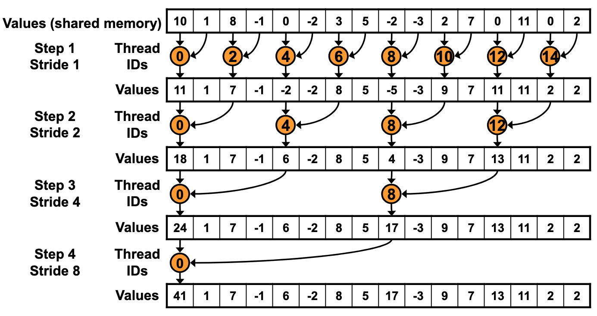
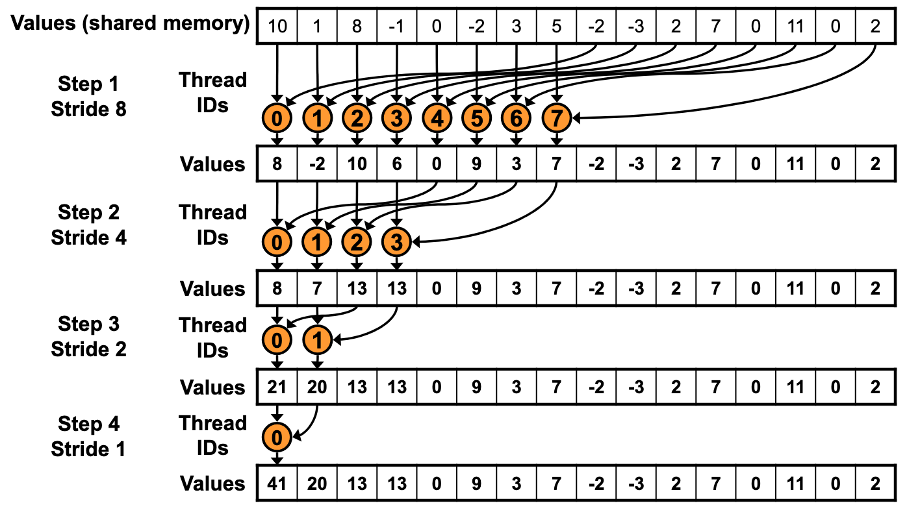

# 术语

**Streaming Processor (SP)**：GPU 中的基本执行单元，具备并行执行能力。

**Streaming Multiprocessor (SM)**：由一组 SP 构成的更高层级计算单元，负责控制和组织在 SP 上执行的任务。

**Thread**：线程，CUDA 的最小执行单位。

**Block**：线程块，由一组线程组成，通常最多包含 1024 个 thread。

**Grid**：由多个 Block 构成的集合。

**Warp**：并行执行的一组线程，通常为 32 个 thread。遵循 SIMD（Single Instruction, Multiple Data）模型，即 32 个线程在不同数据上执行相同指令。

补充关系理解：

* 每个 SM 会处理一定数量的 Blocks
* 每个 SP 可以处理多个 Thread

# CUDA 中的显存分配

`cudaMallocManaged()` 会返回一个既可以被主机（CPU）代码访问，也可以被设备（GPU）代码访问的指针。

如果数据当前位于 CPU 内存中，GPU 在计算时可能发生频繁的缺页，并将数据页拷贝到 GPU，从而降低性能。

`cudaMemPrefetchAsync()` 可以在内核执行前，将数据提前迁移到 GPU，以减少运行时的开销。

# 层级结构

**Compute Capability < 9.0：**

```
Grid
 └── Block
      └── Thread
```

**Compute Capability ≥ 9.0：**

```
Grid
 └── Cluster
      └── Block
           └── Thread
```

说明：

* 一个 Cluster 中的 Blocks 一定会被调度到同一个 GPC 上
* 可以使用分布式共享内存，使数据共享更高效

Cluster 维度的指定方式：

* 编译期：`__cluster_dims__(X, Y, Z)`
* 运行时：`cudaLaunchKernelEx()`

# 内存模型

* Host（CPU）内存：通常通过 `new()`、`malloc()` 分配
* Device（GPU）内存：通过 `cudaMalloc()` 分配

二者默认不能直接互相访问。

**Unified Memory**：CPU 和 GPU 都可以访问同一块内存。

# 硬件执行模型

## SIMT

SIMT（Single Instruction, Multiple Thread）

GPU 不像 CPU 那样具备复杂的控制逻辑（如分支预测、推测执行），而是以相对简单的方式顺序发出指令。

## Warp

* Warp 是由 32 个线程组成的执行单位
* 同一个 Warp 内的线程从相同的程序地址开始执行
* 每个线程拥有独立的寄存器（包括程序计数器等），因此可以发生分支

调度过程：

* 当 SM 获取多个 Thread Blocks 时，会按线程 ID 顺序将线程划分为 Warp（每 32 个一组）
* 每个 Warp 由 Warp 调度器进行调度执行

执行特性：

* 一个 Warp 在某一时刻只能执行一条相同的指令
* 当 32 个线程执行路径一致时，性能最佳
* 若发生分支，不在当前执行路径上的线程会被暂时禁用，例如`if (threadIdx.x % 2 == 0)`
* warp 中参与当前指令执行的线程称为“激活”，未参与执行的称为“非激活”
* 线程处于非激活状态的原因包括：提前退出、执行了不同的分支路径，或位于未填满（不足 32 个线程）的最后一个 warp 中

补充：

* 不同 Warp 之间相互独立执行
* 可并行执行的 block 和 warp 数量，取决于寄存器和共享内存的使用情况（包括 kernel 的需求以及每个多处理器可用的资源）

## Parallel Reduction

> 问题：求一个数组中所有元素的和

### 版本1



最简单的方法：每个thread负责Values中 下标等于自己tid的数据

比如step1时，相加结果保存到0，2，4，…… 那么相加的运算也由tid为0，2，4，……的thread负责

```cpp
__global__ void reduce0(int *g_idata, int *g_odata) {
  extern __shared__ int sdata[];
  // each thread loads one element from global to shared mem
  unsigned int tid = threadIdx.x;
  unsigned int i = blockIdx.x * blockDim.x + threadIdx.x;
  sdata[tid] = g_idata[i];
  __syncthreads();
  
  // do reduction in shared mem
  for (unsigned int s = 1; s < blockDim.x; s *= 2) {
    if (tid % (2 * s) == 0) {
      sdata[tid] += sdata[tid + s];
    }
    __syncthreads();
  }
  
  // write result for this block to global mem
  if (tid == 0) g_odata[blockIdx.x] = sdata[0];
}
```

> [!WARNING]
>
> `if (tid % (2 * s) == 0)`这种判断，造成了warp分支发散导致性能下降
>
> 直接用tid作为下标，对应关系：
>
> ```
> 0 -> 0
> 2 -> 2
> 4 -> 4
> ```
>
> **这样基数tid的线程就得不到运行**
>
> 取模操作非常耗时

### 版本2

> [!NOTE]
>
> tid取值为0，1，2，3，……而每次存储相加结果的下标，与tid有如下关系：
>
> Step1: tid的2倍
>
> Step2: tid的4倍
>
> ……

为了避免warp发散，可以做如下设计：

```cpp
for (unsigned int s = 1; s < blockDim.x; s *= 2) {
  int index = 2 * s * tid;
  
  if (index < blockDim.x) {
    sdata[index] += sdata[index + s];
  }
  __syncthreads();
}
```

现在前一半线程运行，后一半线程不运行，分支比版本1更规整

### 版本3

> [!WARNING]
>
> 版本2虽然做到了线程连续，一定程度提升了性能，但数据访问却不是连续的
>
> 问题出在index计算，每个线程在步长较大时，访问sdata可能跨度极大，导致cache利用不佳
>
> 所以我们直接更改算法，每个Step将相加结果保存在连续的存储空间中



```cpp
for (unsigned int s = blockDim.x/2; s > 0; s >>= 1) {
  if (tid < s) {
    sdata[tid] += sdata[tid + s];
  }
  __syncthreads();
}
```

### 版本4

> [!WARNING]
>
> 虽然这种写法让线程分支更加规整，但 `if (tid < s)` 仍然意味着在每一轮归约中有一半的线程处于空闲状态，从硬件利用率角度来看是一种浪费。
>
> 一个自然的优化思路是：既然只需要一半的线程就可以完成当前 block 的归约工作，那么可以让这些线程在一开始就承担更多的数据处理任务，从而提高整体计算密度。
>
> 具体来说，可以让每个线程在加载阶段同时处理两个数据元素（而不是一个），先在寄存器中完成一次局部累加，再写入 shared memory。这样一来，每个 block 实际上处理的数据量翻倍，但线程数量不变，从而减少了后续归约阶段中线程空闲带来的浪费。

```cpp
unsigned int tid = threadIdx.x;
unsigned int i = blockIdx.x * (blockDim.x * 2) + threadIdx.x;
sdata[tid] = g_idata[i] + g_idata[i + blockDim.x];
__syncthreads();
```


